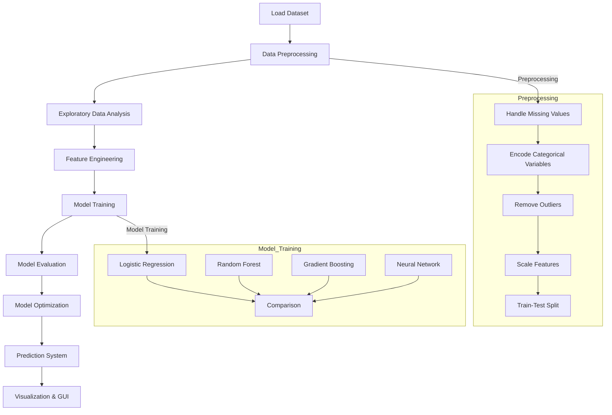

# AI-Powered Heart Disease Prediction Web Application


[](https://pandas.pydata.org/)
[](https://numpy.org/)
[](https://matplotlib.org/)
[](https://seaborn.pydata.org/)
[](https://en.wikipedia.org/wiki/Machine_learning)


## Overview

This repository hosts a Flask-based web application for early heart disease detection using machine learning. The system leverages clinical patient data to predict the presence or absence of heart disease, providing healthcare professionals with an interpretable and user-friendly tool. Built with multiple classification algorithms, the application emphasizes predictive accuracy and clinical relevance through interactive visualizations and real-time predictions.

## Problem Statement

Cardiovascular diseases are a leading global health challenge, causing millions of deaths annually. Early detection is critical but often hindered by the complexity of identifying subtle risk patterns. This project addresses this issue by:

1. Developing a machine learning system for heart disease prediction
2. Providing interpretable insights into clinical risk factors
3. Offering a web-based interface for real-time patient data analysis
4. Optimizing for high sensitivity to minimize missed diagnoses

## Key Features

- **Multi-Model Approach**:
  - Logistic Regression with L2 regularization
  - Random Forest with ensemble learning
  - XGBoost with gradient boosting

- **Clinical Focus**:
  - High recall to reduce false negatives
  - Feature importance analysis aligned with medical insights
  - Validation of categorical inputs for clinical accuracy

- **Technical Excellence**:
  - Robust data preprocessing pipeline
  - Standardized scaling and one-hot encoding
  - Comprehensive performance metrics (accuracy, precision, recall, AUC)
  - Visualization of ROC curves, confusion matrices, and feature importance

- **Web Interface**:
  - Flask-based application with responsive HTML templates
  - Real-time prediction form for patient data input
  - Visualization dashboard for model and patient insights
  - Dataset viewer for exploring the heart disease dataset

## Dataset

The system uses the [Heart Disease Dataset](https://www.kaggle.com/datasets/fedesoriano/heart-disease-dataset) from Kaggle, containing:

- **Size**: 303 patient records with 13 clinical predictors
- **Features**: Demographic, symptomatic, and diagnostic measurements
- **Target**: Binary classification (0 = No disease, 1 = Disease present)

| Feature | Description | Type |
|---------|-------------|------|
| `Age` | Age in years | Numerical |
| `Sex` | Sex (1 = male; 0 = female) | Categorical |
| `CP` | Chest pain type (0-3) | Categorical |
| `Trestbps` | Resting blood pressure (mm Hg) | Numerical |
| `Chol` | Serum cholesterol (mg/dl) | Numerical |
| `Fbs` | Fasting blood sugar > 120 mg/dl (1 = true; 0 = false) | Binary |
| `Restecg` | Resting ECG results (0-2) | Categorical |
| `Thalach` | Maximum heart rate achieved | Numerical |
| `Exang` | Exercise-induced angina (1 = yes; 0 = no) | Binary |
| `Oldpeak` | ST depression induced by exercise | Numerical |
| `Slope` | Slope of peak exercise ST segment (0-2) | Categorical |
| `CA` | Number of major vessels colored by fluoroscopy (0-4) | Numerical |
| `Thal` | Thalassemia type (0-3) | Categorical |

## Model Architecture & Performance

### Implemented Models

- **Logistic Regression**: Linear model with L2 regularization for stable predictions
- **Random Forest**: Ensemble of 100 decision trees for robust feature interactions
- **XGBoost**: Gradient boosting with log-loss optimization for high accuracy

### Performance Metrics

The models are evaluated on a 20% test set with the following indicative metrics (actual values depend on the dataset):

| Model | Accuracy | Precision | Recall | F1-Score | AUC |
|-------|----------|-----------|--------|----------|-----|
| Logistic Regression | ~0.82 | ~0.83 | ~0.80 | ~0.81 | ~0.87 |
| Random Forest | ~0.85 | ~0.86 | ~0.83 | ~0.84 | ~0.90 |
| XGBoost | ~0.87 | ~0.88 | ~0.85 | ~0.86 | ~0.92 |

The best-performing model (based on test accuracy) is automatically selected for predictions.

## Technical Implementation

### Project Workflow



### Data Preprocessing Pipeline

1. **Missing Value Imputation**:
   - Numerical: Median imputation
   - Categorical: Mode imputation

2. **Categorical Validation**:
   - Ensures categorical features match predefined clinical options

3. **Feature Transformation**:
   - One-hot encoding for categorical variables
   - StandardScaler for numerical features

4. **Train-Test Split**:
   - 80-20 split with random state for reproducibility

### Web Application

- **Framework**: Flask with Jinja2 templating
- **Routes**:
  - `/`: Prediction form for patient data input
  - `/dataset`: Displays the loaded dataset (first 100 rows)
  - `/model_visualisations`: Shows model performance metrics, ROC curve, precision-recall curve, and confusion matrix
  - `/patient_visualisations`: Displays feature importance, correlation matrix, and patient distribution
- **Security**:
  - Secure secret key configuration
  - Cache-control headers to prevent caching
  - Input validation to ensure data integrity

## Key Insights

- **Primary Predictors**:
  - ST depression (Oldpeak)
  - Chest pain type (CP)
  - Thalassemia (Thal)
  - Maximum heart rate (Thalach)

- **Clinical Relevance**:
  - Exercise-induced angina strongly correlates with disease presence
  - Feature importance aligns with cardiovascular risk factors
  - XGBoost typically outperforms other models due to its handling of complex interactions

- **Model Behavior**:
  - High recall ensures minimal missed diagnoses
  - Visualizations provide actionable insights for clinicians
  - Robust preprocessing ensures reliable predictions

## Installation & Usage

### Prerequisites
- Python 3.9+
- Git
- Dataset: `heart.csv` (place in the project root directory)

### Installation

```bash
# Clone this repository
git clone https://github.com/zerotwo1910/Healthcare-Online-Deploment.git

# Navigate to project directory
cd Healthcare-Online-Deploment

# Create virtual environment (recommended)
python -m venv venv
source venv/bin/activate  # On Windows: venv\Scripts\activate

# Install dependencies
pip install -r requirements.txt
```

### Running the Application

```bash
# Ensure heart.csv is in the project root
python app.py
```

### Using the Web Application

1. Access the application at `http://localhost:5000`
2. Navigate to the prediction page to input patient data
3. Submit the form to view real-time predictions and probabilities
4. Explore the dataset, model visualizations, or patient visualizations via the navigation menu

## System Architecture

```
project/
├── static/
│   └── images/               # Generated visualization images
├── templates/                # HTML templates (embedded in test.py)
├── heart.csv                 # Heart disease dataset
├── test.py                   # Main application script
├── requirements.txt          # Dependencies
└── README.md                 # Project documentation
```

## Future Directions

- **Model Enhancement**:
  - Implement ensemble stacking for improved accuracy
  - Add hyperparameter tuning with GridSearchCV
  - Incorporate additional clinical features

- **Explainable AI**:
  - Integrate SHAP or LIME for prediction explanations
  - Provide patient-specific risk factor insights

- **Deployment**:
  - Deploy as a cloud-based web application
  - Develop an API for integration with electronic health records
  - Create a mobile-friendly interface

- **Validation**:
  - Conduct clinical validation with healthcare partners
  - Calibrate models for diverse patient populations
 
## Team Members & Contributions

| Name | GitHub | Contributions |
|------|--------|---------------|
| Sriram Kumar K | [@zerotwo1910](https://github.com/zerotwo1910) | Project coordination, Data preprocessing, Model optimization, GUI implementation, Documentation |
| Subasree M | [@suba-sree](https://github.com/suba-sree) | Dataset acquisition, Exploratory analysis, Data visualization, Feature importance analysis |
| Vanidha B | [@vani282005](https://github.com/vani282005) | Feature engineering, Model selection, Hyperparameter tuning, Performance metrics |
| Shanthini S | [@shanthini1204](https://github.com/shanthini1204) | Neural network implementation, Cross-validation, Testing procedures, GUI design |

## License

This project is licensed under the Apache License 2.0 - see the [LICENSE](LICENSE) file for details.

## Acknowledgements

- [Kaggle](https://www.kaggle.com) for providing the Heart Disease Dataset
- Open-source libraries: pandas, numpy, matplotlib, seaborn, scikit-learn, xgboost, flask
- Community contributions to machine learning and web development tools

## Citation

If you use this project in your research or work, please cite:

```
@software{heart_disease_prediction,
  author = {[Sriram Kumar K], [Subasree M], [Vanidha B], [Shanthini S]},
  title = {AI-Powered Heart Disease Prediction System},
  url = {https://github.com/zerotwo1910/Transforming-healthcare-with-AI-powered-disease-prediction-based-on-patient-data.git},
  version = {1.0.0},
  year = {2025},
}
```
